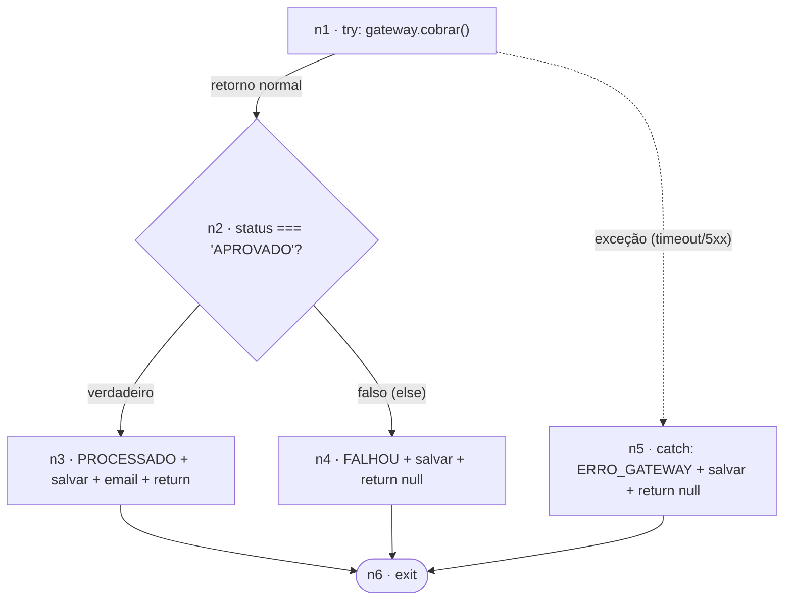

# Análise Estrutural, Complexidade e Métricas de Estimativa

**Componente auditado:** `CheckoutService.processar(pedido)`
**Arquivo:** [`src/services/CheckoutService.js`](../src/services/CheckoutService.js)
**Projeto:** O Apocalipse do Delivery — EntregasJá S.A. (Black Friday)

> Este documento audita o **componente legado original**, *antes* de qualquer refatoração. O objetivo é estabelecer a linha de base estrutural (grafo de fluxo + V(G)) e dimensionar o esforço de teste necessário para blindar a funcionalidade por completo.

---

## 1. Mapeamento de Fluxo — Grafo de Fluxo de Controle (GFC)

### 1.1. Blocos básicos (nós)

| Nó          | Bloco básico                           | Descrição                                                                                                           |
| :----------- | :-------------------------------------- | :-------------------------------------------------------------------------------------------------------------------- |
| **n1** | Entrada /`try`                        | Invoca`gatewayPagamento.cobrar(...)`. Ponto onde uma exceção (timeout, 5xx, conexão recusada) pode ser lançada. |
| **n2** | `if (resposta.status === 'APROVADO')` | **Nó de decisão** (predicado booleano).                                                                       |
| **n3** | Ramo*verdadeiro*                      | `status = PROCESSADO` → `salvar` → `enviarConfirmacao` → `return pedidoSalvo`.                             |
| **n4** | Ramo*falso* (`else`)                | `status = FALHOU` → `salvar` → `return null`.                                                                 |
| **n5** | `catch (error)`                       | `status = ERRO_GATEWAY` → `salvar` → `return null`.                                                           |
| **n6** | Saída /`exit`                        | Nó de retorno único (confluência).                                                                                 |

### 1.2. Arestas (fluxo de controle)

| #  | Aresta   | Condição                                                              |
| :- | :------- | :---------------------------------------------------------------------- |
| a1 | n1 → n2 | `cobrar` retornou normalmente                                         |
| a2 | n1 → n5 | `cobrar` lançou exceção (caminho implícito do `try`→`catch`) |
| a3 | n2 → n3 | `status === 'APROVADO'` (verdadeiro)                                  |
| a4 | n2 → n4 | `status !== 'APROVADO'` (falso)                                       |
| a5 | n3 → n6 | retorno do caminho feliz                                                |
| a6 | n4 → n6 | retorno da falha de negócio                                            |
| a7 | n5 → n6 | retorno da falha de infraestrutura                                      |

**N = 6 nós, E = 7 arestas.**

### 1.3. Diagrama

---

## 2. Complexidade Ciclomática V(G)

Calculada pelas três fórmulas equivalentes de McCabe — todas convergem para **3**.

### 2.1. Pelas arestas e nós

$$
V(G) = E - N + 2 = 7 - 6 + 2 = \mathbf{3}
$$

### 2.2. Pelos nós predicados

Predicados (nós com 2 saídas):

- **n2** — o `if` (1 predicado)
- **n1** — o `try` com aresta de exceção para o `catch` (1 predicado: "sucesso vs. falha da chamada externa")

$$
V(G) = P + 1 = 2 + 1 = \mathbf{3}
$$

### 2.3. Pelas regiões fechadas

O grafo plano delimita 3 regiões (2 regiões internas fechadas + 1 região externa) → $V(G) = \mathbf{3}$.

> **Resultado: V(G) = 3.** O método possui **3 caminhos independentes** — número mínimo de casos de teste para cobertura de caminhos básicos (*basis path coverage*).

### 2.4. Caminhos independentes (base)

| Caminho       | Sequência de nós   | Cenário de negócio                           | Fluxo (matriz de rastreabilidade) |
| :------------ | :------------------- | :--------------------------------------------- | :-------------------------------- |
| **CP1** | n1 → n2 → n3 → n6 | Gateway`APROVADO`: salva e envia e-mail      | **Fluxo 1 (Base)**          |
| **CP2** | n1 → n2 → n4 → n6 | Gateway`RECUSADO`: salva e bloqueia e-mail   | **Fluxo 2 (Negócio)**      |
| **CP3** | n1 → n5 → n6       | Exceção do gateway: fallback`ERRO_GATEWAY` | **Fluxo 4 (Caos)**          |

---

## 3. Análise de cobertura e *gap* estrutural (legado × especificação)

A matriz de rastreabilidade da especificação define **5 fluxos**, mas o legado só implementa estruturalmente **3** (V(G)=3). Isto evidencia a dívida técnica que os eventuais redesign e refatoração deverão saldar:

| Fluxo da especificação                     | Coberto pelo legado?  | Observação estrutural                                                                                              |
| :------------------------------------------- | :-------------------- | :------------------------------------------------------------------------------------------------------------------- |
| Fluxo 1 — Base (`PROCESSADO`)             | ✅ CP1                | OK, mas e-mail é**síncrono** (viola RF02).                                                                   |
| Fluxo 2 — Negócio (`FALHOU`)             | ✅ CP2                | OK.                                                                                                                  |
| Fluxo 3 — Resiliência (1 retry → sucesso) | ❌**ausente**   | Não há`retry`/`backoff` (RN05/RN06).                                                                           |
| Fluxo 4 — Caos (`ERRO_GATEWAY`)           | ⚠️ parcial (CP3)    | `catch` existe, mas falha "bruta": sem 3 retentativas, sem *circuit breaker*, sem *timeout* de 2s (RN04/RN07). |
| Fluxo 5 — Contrato (`400 Bad Request`)    | ❌ fora do componente | Validação está no`server.js`, não em `processar`.                                                            |

**Conclusão:** o redesign introduzirá *timeout*, *retry/backoff* e *circuit breaker*, elevando a complexidade ciclomática do componente. A meta de *clean code* será manter **V(G) ≤ ~4 por método**, extraindo a política de resiliência (Extract Method / objeto de política) em vez de inchar `processar` com `if/else` aninhados — caso contrário a complexidade alvo do fluxo monolítico saltaria para ~9–10.

---

## 4. Documento Formal de Estimativa de Esforço de Teste

Técnica adotada: **Análise de Pontos de Função (APF) adaptada para testes** — contamos os Pontos de Função da funcionalidade, ajustamos pelo Fator de Ajuste (características de sistema críticas nesta Black Friday) e convertemos os PF ajustados em horas de
teste por um índice de produtividade específico de QA.

### 4.1. Funções de dados

| Função                              | Tipo | DETs / RETs                                      | Complexidade | PF           |
| :------------------------------------ | :--- | :----------------------------------------------- | :----------- | :----------- |
| Pedido (via`PedidoRepository`)      | ALI  | clienteEmail, valor, cartão, status, id / 1 RET | Baixa        | 7            |
| Autorização do Gateway de Pagamento | AIE  | status, código de autorização / 1 RET         | Baixa        | 5            |
| **Subtotal dados**              |      |                                                  |              | **12** |

### 4.2. Funções de transação

| Função                                                        | Tipo | ALR (FTR) / DET                   | Complexidade | PF           |
| :-------------------------------------------------------------- | :--- | :-------------------------------- | :----------- | :----------- |
| Processar checkout (`POST /api/v1/checkout`)                  | EE   | 2 FTR (Pedido + Gateway) / ~6 DET | Média       | 4            |
| Confirmação de pagamento (resposta 200 + e-mail assíncrono)  | SE   | 2 FTR / msg + payload             | Média       | 5            |
| Sinalização de recusa/erro (400/500 + transições de status) | SE   | 2 FTR / mensagens derivadas       | Média       | 5            |
| **Subtotal transação**                                  |      |                                   |              | **14** |

### 4.3. Pontos de Função Não Ajustados (PFNA)

$$
PFNA = 12 + 14 = \mathbf{26\ PF}
$$

### 4.4. Fator de Ajuste (VAF) — 14 Características Gerais do Sistema

Avaliação 0–5 por característica (ên==fase== nos requisitos não-funcionais críticos):

| # | Característica                                 | Nível | #  | Característica                   | Nível |
| :- | :---------------------------------------------- | :----: | :- | :-------------------------------- | :----: |
| 1 | Comunicação de dados                          |   4   | 8  | Atualização*online*           |   3   |
| 2 | Processamento distribuído                      |   4   | 9  | Processamento complexo (retry/CB) |   4   |
| 3 | **Performance** (SLO p95<2500ms)          |   5   | 10 | Reusabilidade                     |   3   |
| 4 | Configuração intensa                          |   3   | 11 | Facilidade de instalação        |   2   |
| 5 | **Volume de transações** (Black Friday) |   5   | 12 | Facilidade operacional            |   3   |
| 6 | Entrada de dados*online*                      |   4   | 13 | Múltiplos locais                 |   3   |
| 7 | Eficiência do usuário final                   |   2   | 14 | Facilidade de mudanças           |   3   |

$$
\textstyle\sum NI = 48 \qquad VAF = 0{,}65 + (0{,}01 \times 48) = \mathbf{1{,}13}
$$

### 4.5. Pontos de Função Ajustados (PFA)

$$
PFA = PFNA \times VAF = 26 \times 1{,}13 = 29{,}38 \approx \mathbf{29\ PF}
$$

### 4.6. Conversão PF → esforço de teste

Índice de produtividade de teste adotado: **4,0 h/PF**. Este índice cobre o ciclo completo de qualidade exigido pelo trabalho (não apenas codificação): planejamento, BDD, automação unitária/integração via TDD, endurecimento por mutação (meta ≥90%) e
caos/performance.

$$
\text{Esforço base} = 29\ PF \times 4{,}0\ \text{h/PF} = \mathbf{116\ h}
$$

**Reserva de risco (+15%)** — sobrevivência de mutantes/equivalentes, tuning de *thresholds* k6 e ajuste fino do Toxiproxy:

$$
\text{Esforço total} = 116 \times 1{,}15 \approx \mathbf{133\ horas/homem}
$$

### 4.7. Distribuição do esforço por atividade (visão *bottom-up* — reconciliação)

| Atividade de teste                                                            |  Esforço (h) |              % |
| :---------------------------------------------------------------------------- | ------------: | -------------: |
| Planejamento, análise estrutural e estimativa (este documento)               |            12 |             9% |
| Cenários BDD/Gherkin (5 fluxos)                                              |            16 |            12% |
| Automação unitária + integração via TDD (red-green-refactor)             |            34 |            26% |
| Configuração de*test patterns* (Data Builder/Object Mother, Stubs, Mocks) |            12 |             9% |
| Teste de mutação (Stryker) + eliminação de sobreviventes até ≥90%       |            24 |            18% |
| Scripts de carga/estresse k6 (ramp-up/steady/ramp-down) + SLO                 |            18 |            14% |
| Engenharia do caos (Toxiproxy: Thundering Herd + gateway lento)               |            12 |             9% |
| Relatórios, evidências e cálculo de MTTR                                   |             5 |             4% |
| **Total**                                                               | **133** | **100%** |

> O total *bottom-up* (133 h) reconcilia com a estimativa *top-down* por PF,
> conferindo maturidade e confiabilidade à estimativa.

### 4.8. Recursos necessários

**Equipe (4 papéis):**

| Papel                             | Responsabilidade principal                                     | Alocação |
| :-------------------------------- | :------------------------------------------------------------- | :--------- |
| Arquiteto(a) de Testes            | Estratégia, análise estrutural, estimativa,*test patterns* | ~30 h      |
| Engenheiro(a) de Automação QA#1 | BDD/Gherkin + automação unitária TDD                        | ~38 h      |
| Engenheiro(a) de Automação QA#2 | Integração, teste de mutação, eliminação de mutantes     | ~37 h      |
| Engenheiro(a) SRE                 | k6, Toxiproxy, caos, SLO/MTTR                                  | ~28 h      |

**Ambiente e ferramentas:**

| Categoria                      | Itens                                            |
| :----------------------------- | :----------------------------------------------- |
| Runtime                        | Node.js 22.19, npm 10.9                          |
| Testes unitários/integração | Jest                                             |
| BDD                            | @cucumber/cucumber (Gherkin)                     |
| Teste de mutação             | Stryker.js (meta ≥90%)                          |
| Carga/estresse                 | k6                                               |
| Injeção de falhas            | Toxiproxy (via Docker)                           |
| Infra de caos                  | Docker Desktop (WSL2)                            |
| CI/Versionamento               | Git + pipeline para execução linear dos testes |

### 4.9. Cronograma sintético (esforço paralelizado em equipe de 4)

| Janela      | Foco                      | Marco                              |
| :---------- | :------------------------ | :--------------------------------- |
| Semana 1    | Análise + estimativa     | GFC + V(G) aprovados               |
| Semana 2–3 | BDD + TDD + refatoração | 5 fluxos verdes                    |
| Semana 4    | Mutação                 | Mutation Score ≥90%               |
| Semana 5    | k6 + Toxiproxy            | SLO mantido sob caos + MTTR medido |

---

## 5. Síntese executiva

| Métrica                                              | Valor                                |
| :---------------------------------------------------- | :----------------------------------- |
| Complexidade Ciclomática V(G)                        | **3**                          |
| Caminhos independentes (mínimo de testes de caminho) | **3** (CP1, CP2, CP3)          |
| Casos de teste funcionais (matriz de rastreabilidade) | **5 fluxos**                   |
| Pontos de Função Não Ajustados                     | 26 PF                                |
| Fator de Ajuste (VAF)                                 | 1,13                                 |
| Pontos de Função Ajustados                          | 29 PF                                |
| **Esforço estimado de teste**                  | **≈ 133 horas/homem**         |
| Equipe                                                | 4 pessoas (Arq. Testes, 2 QA, 1 SRE) |
